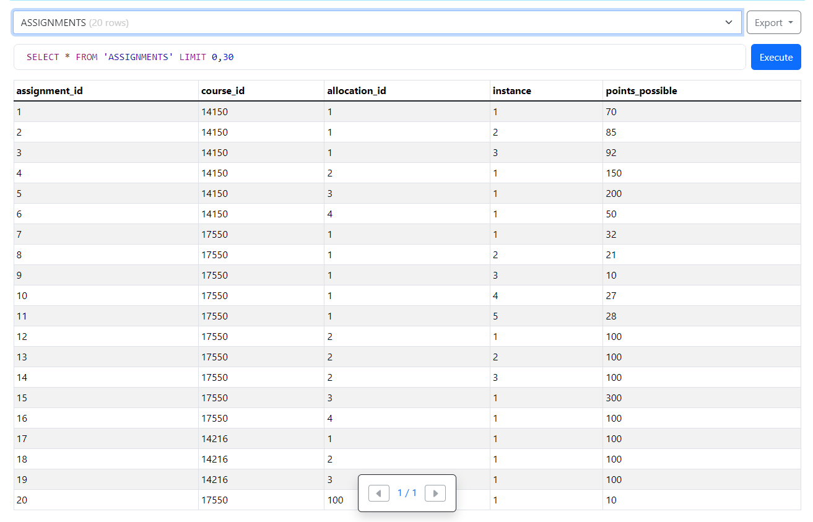
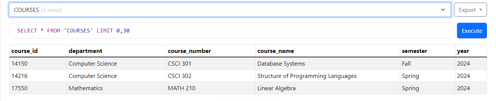
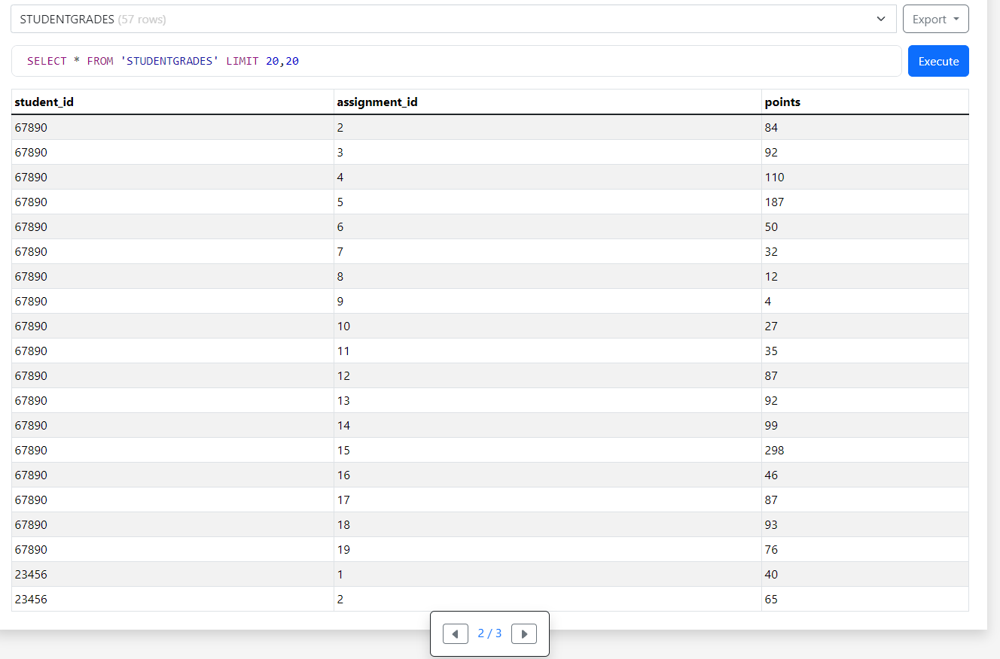

# CSCI 432 Database Systems Grade Book Database Project
Authors: Sydney Stokes, Joshua Wallington, Courtney Young


## Project Submission

## Installation Guide

### Using Visual Studio Code:

1. **Install SQLite Extension**: Download and install the SQLite extension (`alexcvzz.vscode-sqlite`) created by alexcvzz from the Visual Studio Code Marketplace.
   
2. **Open Database File**: Access the Command Palette in Visual Studio Code and open the database file (`gradebook_database.db`) from the repository.

### Creating the Database File:

If the database file does not exist:

1. **Run Python Script**: Navigate to the repository directory and run the Python script `main.py` using the following command:

```python
python3 main.py
```

This script will create a file named `gradebook_database.db` containing the database.

### Viewing Database Online:

If you prefer to use online tools to examine the database:

1. **Use SQLite Viewer**: You can use a free online tool called SQLite Viewer ([https://inloop.github.io/sqlite-viewer/](https://inloop.github.io/sqlite-viewer/)) to upload the `.db` file and visualize its contents.


### ER Diagram


### Commands For Creating Tables And Inserting Values

#### Create STUDENTS table
~~~~sql
CREATE TABLE "STUDENTS" (
    "first_name" varchar(255) DEFAULT NULL,
    "last_name" varchar(255) DEFAULT NULL,
    "major" varchar(255) DEFAULT NULL,
    "student_id" INTEGER PRIMARY KEY AUTOINCREMENT
);
~~~~

#### Create COURSES table
~~~~sql
CREATE TABLE "COURSES" (
    "course_id" INTEGER PRIMARY KEY AUTOINCREMENT,
    "department" varchar(255) DEFAULT NULL,
    "course_number" varchar(255) DEFAULT NULL,
    "course_name" varchar(255) DEFAULT NULL,
    "semester" varchar(255) DEFAULT NULL,
    "year" varchar(255) DEFAULT NULL
);
~~~~

#### Create REGISTRATIONS table
~~~~sql
CREATE TABLE "REGISTRATIONS" (
    "student_id" INTEGER,
    "course_id" INTEGER,
    PRIMARY KEY ("student_id", "course_id"),
    FOREIGN KEY ("student_id") REFERENCES "STUDENTS"("student_id"),
    FOREIGN KEY ("course_id") REFERENCES "COURSES"("course_id")
);
~~~~

#### Create ASSIGNMENTS table
~~~~sql
CREATE TABLE "ASSIGNMENTS" (
    "assignment_id" INTEGER PRIMARY KEY AUTOINCREMENT,
    "course_id" INTEGER NOT NULL,
    "allocation_id" INTEGER NOT NULL,
    "instance" INTEGER NOT NULL,
    "points_possible" INTEGER DEFAULT 0 NOT NULL,
    FOREIGN KEY ("course_id") REFERENCES "COURSES"("course_id"),
    FOREIGN KEY ("allocation_id") REFERENCES "ALLOCATION"("allocation_id")
);
~~~~

#### Create STUDENTGRADES table
~~~~sql
CREATE TABLE "STUDENTGRADES" (
    "student_id" INTEGER NOT NULL,
    "assignment_id" INTEGER NOT NULL,
    "points" INTEGER DEFAULT 0 NOT NULL,
    PRIMARY KEY ("student_id", "assignment_id"),
    FOREIGN KEY ("student_id") REFERENCES "STUDENTS"("student_id"),
    FOREIGN KEY ("assignment_id") REFERENCES "ASSIGNMENTS"("assignment_id")
);

~~~~

#### Create ALLOCATIONS table
~~~~sql
CREATE TABLE "ALLOCATIONS" (
    "allocation_id" INTEGER PRIMARY KEY,
    "course_id" INTEGER NOT NULL,
    "category_name" VARCHAR(30) NOT NULL,
    "percentage" INTEGER NOT NULL,
    FOREIGN KEY ("course_id") REFERENCES "COURSES"("course_id")
);
~~~~

#### Example commands for inserting into STUDENTS table
~~~~sql
INSERT INTO `STUDENTS` VALUES('Joshua', 'Wallington', 'Computer Science', 13845);
INSERT INTO `STUDENTS` VALUES('Courtney', 'Young', 'Computer Science', 67890);
INSERT INTO `STUDENTS` VALUES('Sydney', 'Stokes', 'Computer Science', 23456);
~~~~

#### Example commands for inserting into COURSES table
~~~~sql
INSERT INTO `COURSES` VALUES (14150, 'Computer Science', 'CSCI 301', 'Database Systems', 'Fall', 2024);
INSERT INTO `COURSES` VALUES (17550, 'Mathematics', 'MATH 210', 'Linear Algebra', 'Spring', 2024);
INSERT INTO `COURSES` VALUES (14216, 'Computer Science', 'CSCI 302', 'Structure of Programming Languages', 'Spring', 2024);
~~~~

#### Example commands for inserting into REGISTRATIONS table
~~~~sql
INSERT INTO `REGISTRATIONS` VALUES(13845, 14150); -- Register Joshua Wallington (13845) for CSCI 301 (14150)
INSERT INTO `REGISTRATIONS` VALUES(67890, 14150); -- Register Courtney Young (67890) for CSCI 301 (14150)
INSERT INTO `REGISTRATIONS` VALUES(23456, 14150); -- Register Sydney Stokes (23456) for CSCI 301 (14150)
~~~~

#### Example commands for inserting into ASSIGNMENTS table
~~~~sql
    INSERT INTO `ASSIGNMENTS` VALUES(4, 14150, 2, 1, 150); -- Midterm exam worth 150 points
    INSERT INTO `ASSIGNMENTS` VALUES(5, 14150, 3, 1, 200); -- Final exam worth 200 points
    INSERT INTO `ASSIGNMENTS` VALUES(7, 17550, 1, 1, 32); -- Quiz 1 worth 32 points 
    INSERT INTO `ASSIGNMENTS` VALUES(8, 17550, 1, 2, 21); -- Quiz 2 worth 21 points
    INSERT INTO `ASSIGNMENTS` VALUES(17, 14216, 1, 1, 100); -- Participation / Attendance worth 100 points
~~~~

#### Example commands for inserting into ALLOCATIONS table
~~~~sql
INSERT INTO `ALLOCATIONS` VALUES(1, 14150, 'Attendance', 10); --Database Systems Class
INSERT INTO `ALLOCATIONS` VALUES(2, 14150, 'Homework', 20); --Database Systems Class
INSERT INTO `ALLOCATIONS` VALUES(3, 14150, 'Midterm', 30); --Database Systems Class
INSERT INTO `ALLOCATIONS` VALUES(4, 14150, 'Final Exam', 40); --Database Systems Class
~~~~

#### Example commands for inserting into STUDENTGRADES table
~~~~sql
INSERT INTO `STUDENTGRADES` VALUES(13845, 1, 70); -- Homework 1 worth 70 points
INSERT INTO `STUDENTGRADES` VALUES(67890, 11, 35); -- Quiz 5 worth 25 points
INSERT INTO `STUDENTGRADES` VALUES(23456, 9, 10); -- Quiz 3 worth 10 points
~~~~

### Tables With The Contents That You Have Inserted

#### Allocations Table


#### Assignments Table


#### Courses Table


#### Registrations Table


#### Student Grades Table

*Student Grades Table 1/3*


*Student Grades Table 2/3*


*Student Grades Table 3/3*

#### Students Table

*Students Table*

### Commands that you use to get task 4, 5, 6, 7, 8, 9, 10, 11, 12;

#### Compute the average/highest/lowest score of an assignment (4);
~~~~sql
-- AVERAGE
    SELECT assignment_id, AVG(points) AS avg_score FROM STUDENTGRADES GROUP BY assignment_id;

-- HIGHEST
    SELECT assignment_id, MAX(points) AS highest_score FROM STUDENTGRADES GROUP BY assignment_id;

-- LOWEST
    SELECT assignment_id, MIN(points) AS lowest_score FROM STUDENTGRADES GROUP BY assignment_id;
~~~~

#### List all of the students in a given course (5);

~~~~sql
SELECT S.first_name, S.last_name 
FROM STUDENTS S 
JOIN REGISTRATIONS R 
ON S.student_id = R.student_id 
JOIN COURSES C 
ON R.course_id = C.course_id 
WHERE C.course_name = 'Database Systems';
~~~~


#### List all of the students in a course and all of their scores on every assignment (6);

~~~~sql
SELECT S.first_name, S.last_name, AG.assignment_id, SG.points
FROM STUDENTS S
JOIN REGISTRATIONS R ON S.student_id = R.student_id
JOIN COURSES C ON R.course_id = C.course_id
JOIN ASSIGNMENTS AG ON C.course_id = AG.course_id
LEFT JOIN STUDENTGRADES SG ON S.student_id = SG.student_id AND AG.assignment_id = SG.assignment_id
WHERE C.course_name = 'Database Systems';
~~~~


#### Add an assignment to a course (7);

~~~~sql
 INSERT INTO ASSIGNMENTS (course_id, allocation_id, instance, points_possible)
        VALUES (17550, 100, 1, 10);
~~~~


#### Change the percentages of the categories for a course (8);

~~~~sql
UPDATE ALLOCATIONS
    SET percentage = 5
    WHERE course_id = 17550 AND category_name = 'Attendance'; 
~~~~


#### Add 2 points to the score of each student on an assignment (9);

~~~~sql
UPDATE STUDENTGRADES
    SET points = points + 2
    WHERE assignment_id = 17550;
~~~~

#### Add 2 points just to those students whose last name contains a ‘Q’ (10).

~~~~sql
UPDATE STUDENTGRADES
    SET points = points + 2
    WHERE assignment_id = 17550
    AND student_id IN (SELECT student_id FROM STUDENTS WHERE last_name LIKE '%Q%');
~~~~


#### Compute the grade for a student (11);

~~~~sql
WITH WeightedGrades AS (
    SELECT S.first_name,  S.last_name, S.student_id, C.course_name, A.category_name,
        AVG(SG.points * 1.0 / AG.points_possible) AS points_percentage, 
        A.percentage AS grade_weight
    FROM STUDENTGRADES SG
    JOIN ASSIGNMENTS AG ON SG.assignment_id = AG.assignment_id
    JOIN ALLOCATIONS A ON AG.allocation_id = A.allocation_id
    JOIN COURSES C ON AG.course_id = C.course_id
    JOIN STUDENTS S ON SG.student_id = S.student_id
    GROUP BY S.student_id, C.course_name, A.category_name
)
SELECT 
    first_name, last_name, student_id, course_name,
    ROUND((SUM(grade_weight * points_percentage) / SUM(grade_weight)) * 100, 2) AS grade_percentage,
    CASE
        WHEN ROUND((SUM(grade_weight * points_percentage) / SUM(grade_weight)) * 100, 2) >= 90 THEN 'A'
        WHEN ROUND((SUM(grade_weight * points_percentage) / SUM(grade_weight)) * 100, 2) >= 80 THEN 'B'
        WHEN ROUND((SUM(grade_weight * points_percentage) / SUM(grade_weight)) * 100, 2) >= 70 THEN 'C'
        WHEN ROUND((SUM(grade_weight * points_percentage) / SUM(grade_weight)) * 100, 2) >= 60 THEN 'D'
        ELSE 'F'
    END AS letter_grade
FROM WeightedGrades
GROUP BY first_name, last_name, student_id, course_name;
~~~~


#### Compute the grade for a student, where the lowest score for a given category is dropped (12)

~~~~sql
WITH WeightedGrades AS (
    SELECT S.first_name, S.last_name, S.student_id, C.course_name, A.category_name,
        AVG(SG.points * 1.0 / AG.points_possible) AS points_percentage, 
        A.percentage AS grade_weight,
        ROW_NUMBER() OVER(PARTITION BY S.student_id, C.course_name, A.category_name ORDER BY SG.points ASC) AS rank
    FROM STUDENTGRADES SG
    JOIN ASSIGNMENTS AG ON SG.assignment_id = AG.assignment_id
    JOIN ALLOCATIONS A ON AG.allocation_id = A.allocation_id
    JOIN COURSES C ON AG.course_id = C.course_id
    JOIN STUDENTS S ON SG.student_id = S.student_id
    GROUP BY S.student_id, C.course_name, A.category_name, SG.assignment_id
)
, FilteredGrades AS (
    SELECT * FROM WeightedGrades WHERE rank > 1
)
SELECT 
    first_name, last_name, student_id, course_name,
    ROUND((SUM(grade_weight * points_percentage) / SUM(grade_weight)) * 100, 2) AS grade_percentage,
    CASE
        WHEN ROUND((SUM(grade_weight * points_percentage) / SUM(grade_weight)) * 100, 2) >= 90 THEN 'A'
        WHEN ROUND((SUM(grade_weight * points_percentage) / SUM(grade_weight)) * 100, 2) >= 80 THEN 'B'
        WHEN ROUND((SUM(grade_weight * points_percentage) / SUM(grade_weight)) * 100, 2) >= 70 THEN 'C'
        WHEN ROUND((SUM(grade_weight * points_percentage) / SUM(grade_weight)) * 100, 2) >= 60 THEN 'D'
        ELSE 'F'
    END AS letter_grade
FROM FilteredGrades
WHERE category_name = 'Quizzes'
GROUP BY first_name, last_name, student_id, course_name;
~~~~

### Test Code Results


#### Testing for adding 2 points to the score of each student on an assignment
~~~~sql
-- Testing for adding 2 points to the score of each student on an assignment:
    -- Show Table
        SELECT * FROM 'STUDENTGRADES' WHERE assignment_id = 2;
    -- Update
        UPDATE STUDENTGRADES
        SET points = points + 2
        WHERE assignment_id = 2; 
    -- Show after update
        SELECT * FROM 'STUDENTGRADES' WHERE assignment_id = 2;
~~~~


#### Compute the grade for a student (Includes letter grade and percentage based on the weights)

~~~~sql
    WITH WeightedGrades AS (
    SELECT S.first_name,  S.last_name, S.student_id, C.course_name, A.category_name,
        AVG(SG.points * 1.0 / AG.points_possible) AS points_percentage, 
        A.percentage AS grade_weight
    FROM STUDENTGRADES SG
    JOIN ASSIGNMENTS AG ON SG.assignment_id = AG.assignment_id
    JOIN ALLOCATIONS A ON AG.allocation_id = A.allocation_id
    JOIN COURSES C ON AG.course_id = C.course_id
    JOIN STUDENTS S ON SG.student_id = S.student_id
    GROUP BY S.student_id, C.course_name, A.category_name
)
SELECT 
    first_name, last_name, student_id, course_name,
    ROUND((SUM(grade_weight * points_percentage) / SUM(grade_weight)) * 100, 2) AS grade_percentage,
    CASE
        WHEN ROUND((SUM(grade_weight * points_percentage) / SUM(grade_weight)) * 100, 2) >= 90 THEN 'A'
        WHEN ROUND((SUM(grade_weight * points_percentage) / SUM(grade_weight)) * 100, 2) >= 80 THEN 'B'
        WHEN ROUND((SUM(grade_weight * points_percentage) / SUM(grade_weight)) * 100, 2) >= 70 THEN 'C'
        WHEN ROUND((SUM(grade_weight * points_percentage) / SUM(grade_weight)) * 100, 2) >= 60 THEN 'D'
        ELSE 'F'
    END AS letter_grade
FROM WeightedGrades
GROUP BY first_name, last_name, student_id, course_name;
~~~~


#### Compute the grade for a student, where the lowest score for a given category is dropped. (Drop lowest in linear algebra)

~~~~sql
WITH WeightedGrades AS (
    SELECT S.first_name, S.last_name, S.student_id, C.course_name, A.category_name,
        AVG(SG.points * 1.0 / AG.points_possible) AS points_percentage, 
        A.percentage AS grade_weight,
        ROW_NUMBER() OVER(PARTITION BY S.student_id, C.course_name, A.category_name ORDER BY SG.points ASC) AS rank
    FROM STUDENTGRADES SG
    JOIN ASSIGNMENTS AG ON SG.assignment_id = AG.assignment_id
    JOIN ALLOCATIONS A ON AG.allocation_id = A.allocation_id
    JOIN COURSES C ON AG.course_id = C.course_id
    JOIN STUDENTS S ON SG.student_id = S.student_id
    GROUP BY S.student_id, C.course_name, A.category_name, SG.assignment_id
)
, FilteredGrades AS (
    SELECT * FROM WeightedGrades WHERE rank > 1
)
SELECT 
    first_name, last_name, student_id, course_name,
    ROUND((SUM(grade_weight * points_percentage) / SUM(grade_weight)) * 100, 2) AS grade_percentage,
    CASE
        WHEN ROUND((SUM(grade_weight * points_percentage) / SUM(grade_weight)) * 100, 2) >= 90 THEN 'A'
        WHEN ROUND((SUM(grade_weight * points_percentage) / SUM(grade_weight)) * 100, 2) >= 80 THEN 'B'
        WHEN ROUND((SUM(grade_weight * points_percentage) / SUM(grade_weight)) * 100, 2) >= 70 THEN 'C'
        WHEN ROUND((SUM(grade_weight * points_percentage) / SUM(grade_weight)) * 100, 2) >= 60 THEN 'D'
        ELSE 'F'
    END AS letter_grade
FROM FilteredGrades
WHERE category_name = 'Quizzes'
GROUP BY first_name, last_name, student_id, course_name;
~~~~


## Project Checklist

**Tasks**
- [X] Design the ER diagram
- [X] Write the commands for creating tables and inserting values
- [X] Show the tables with the contents that you have inserted
- [X] Compute the average/highest/lowest score of an assignment
- [X] List all of the students in a given course
- [X] List all of the students in a course and all of their scores on every assignment
- [X] Add an assignment to a course
- [X] Change the percentages of the categories for a course
- [X] Add 2 points to the score of each student on an assignment
- [X] Add 2 points just to those students whose last name contains a 'Q'.
- [X] Compute the grade for a student
- [X] Compute the grade for a student, where the lowest score for a given category is dropped.

**Submission**
- [X] The ER diagram (with the attributes and foreign keys/primary keys indicated);
- [X] The commands for creating tables and inserting values (task 2);
- [X] The tables with the contents that you have inserted (task 3);
- [X] The command that you use to get task 4, 5, 6, 7, 8, 9, 10, 11, 12;
- [X] The source code;
- [X] A README file. The minimum required content of the file should contains the instructions to compile and execute your code;
- [X] The test cases that you use and the results that you get from the test cases.